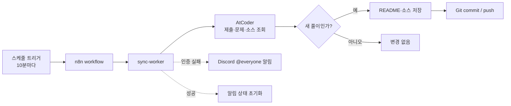

# 심심알고

개인 알고리즘 풀이 저장소입니다. 문제를 풀고, 풀이를 쌓고, 다시 찾아보기 쉽게 정리합니다.

- GitHub: [red-sprout/SimSimAlgo](https://github.com/red-sprout/SimSimAlgo)
- 풀이 계정: `red-sprout`, `sprout6626`
- 과거 풀이 저장소: `coding_test_study`

## 풀이 목록

| 사이트 | 경로 | 비고 |
| --- | --- | --- |
| 프로그래머스 | [프로그래머스](./프로그래머스) | SQL · C++ |
| 백준 | [백준](./백준) | C++ |
| AtCoder | [AtCoder](./AtCoder) | C++ |

각 문제는 난이도별 디렉터리 또는 대회별 디렉터리에 문제 설명과 풀이를 함께 둡니다.

## 자동화

n8n이 주기적으로 풀이 사이트를 확인하고, 새 풀이를 저장한 뒤 Git commit/push까지 수행합니다.

```text
n8n (10분 주기)
  └─ sync-worker
       ├─ AtCoder Accepted 제출 조회
       ├─ 문제 설명·소스 저장
       ├─ Git commit / push
       └─ 인증 오류 시 Discord 알림
```

현재 자동 동기화는 AtCoder부터 운영 중이며, 프로그래머스는 인증·제출 구조를 조사하며 연동 방식을 정리하고 있습니다.




AtCoder는 `n8n/workflows/atcoder-submit.json`을 가져오면 제출 폼도 사용할 수 있습니다. 폼에 Java 코드를 입력하면 워커가 `oj`로 제출하고, 판정이 `AC`인 경우에만 풀이 파일을 만들고 commit/push합니다. `WA`·런타임 오류·인증 실패에서는 Git 변경이 발생하지 않습니다.


### 운영 문서

- [진행 상황](./docs/progress.md)
- [운영 가이드](./docs/operations.md)
- [아키텍처](./docs/architecture.md)
- [자동화 로드맵](./docs/roadmap.md)
- [보안 원칙](./docs/security.md)
- [프로그래머스 조사 기록](./docs/research/programmers.md)
- [AtCoder 조사 기록](./docs/research/atcoder.md)

### 로컬 자동화 실행

```bash
cd automation
npm install
npm test
npm run sync:atcoder -- --dry-run
```

실제 n8n 배포와 세션 설정은 [운영 가이드](./docs/operations.md)를 참고합니다. 세션 쿠키, Webhook URL, SSH 키 같은 민감한 값은 저장소에 커밋하지 않습니다.

## 디렉터리 구조

```text
.
├── 프로그래머스/       # 프로그래머스 풀이
├── 백준/               # 백준 풀이
├── AtCoder/            # AtCoder 풀이
├── automation/         # 사이트 어댑터·동기화 worker
├── n8n/                # n8n compose와 workflow
└── docs/               # 설계·운영·조사 문서
```

## 라이선스

개인 학습 기록을 위한 저장소입니다. 문제 원문과 플랫폼 제공 콘텐츠의 저작권은 각 서비스에 있습니다.
